# Самостоятельная работа 3

## Предметная область для практических заданий: **Судоходство**

Пример схемы для задания

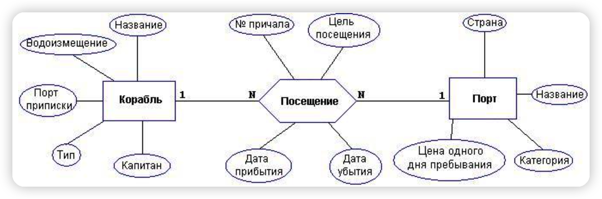

<div STYLE="page-break-after: always;"></div>

### Реализация

ER-диаграмма, полученная с помощью DataGrip:
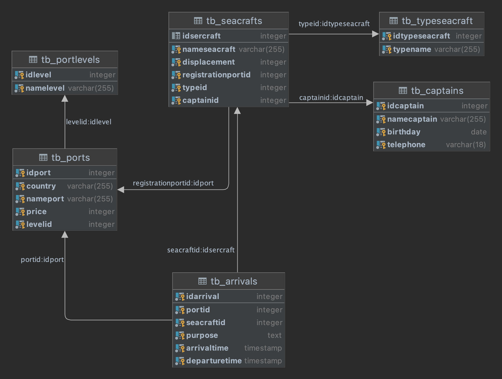

<div STYLE="page-break-after: always;"></div>

## Создание и заполнение таблиц

### Постановка задачи

Практическое задание заключается в подготовке SQL-скрипта для создания таблиц согласно схеме, полученной в предыдущем задании (с уточнением типов столбцов). Необходимо определить первичные и внешние ключи, а также декларативные ограничения целостности (возможность принимать неопределенное значение, уникальные ключи, проверочные ограничения и т. д.). Таблицы следует создавать в отдельной базе данных. Кроме того, нужно подготовить данные для заполнения созданных таблиц. Объем подготовленных данных должен составлять не менее 10 экземпляров для каждой из стержневых (неподчиняющиеся основные сущности) сущностей и 15 экземпляров для каждой из ассоциативных (подчиненные многие-ко-многим). На основе этих данных необходимо создать SQL-скрипт для вставки соответствующих строк в таблицы БД.

### Реализация
Полный дамп базы данных [dump БД](/practice/sam_3_function/dump.sql) 

Команды SQL, используемые для создания базы данных:

```sql
DROP DATABASE IF EXISTS db_Port;
CREATE DATABASE db_Port
WITH
  OWNER = ""
  TABLESPACE = ""
;
```

Команды SQL для создания таблиц:

```sql
-- Корабль
DROP TABLE IF EXISTS tb_Seacrafts;
CREATE TABLE IF NOT EXISTS tb_Seacrafts
(
	IDSeacraft				SERIAL,
	NameSeacraft			VARCHAR(255)	NOT NULL,		-- Название
	Displacement			INTEGER 		NOT NULL,		-- Водоизменение
	RegPortID				INTEGER			NOT NULL,		-- Порт приписки
	TypeID					INTEGER			NOT NULL,		-- Тип
	CaptainID				INTEGER			NOT NULL		-- Капитан
);

-- Посещение
DROP TABLE IF EXISTS tb_Arrivals;
CREATE TABLE IF NOT EXISTS tb_Arrivals
(
	IDArrival				SERIAL,
	PortID					INTEGER			NOT NULL,		-- № причала
	SeacraftID				INTEGER			NOT NULL,		
	Purpose					TEXT			NULL,		 	-- Цель посещения
	ArrivalTime				TIMESTAMP		NOT NULL,		-- Дата прибытия
	LeaveTime				TIMESTAMP		NULL 			-- Дата убытия
);

-- Порт
DROP TABLE IF EXISTS tb_Ports;
CREATE TABLE IF NOT EXISTS tb_Ports
(
	IDPort					SERIAL,
	Country					VARCHAR(255)	NOT NULL,		-- Страна
	NamePort				VARCHAR(255)	NOT NULL,		-- Название
	Price					INTEGER			NOT NULL,		-- Цена 1-ого для пребывания
	LevelID					INTEGER			NOT NULL		-- Категория
);

-- Категория
DROP TABLE IF EXISTS tb_PortLevels;
CREATE TABLE IF NOT EXISTS tb_PortLevels
(
	IDLevel					SERIAL,
	NameLevel				VARCHAR(255)	NOT NULL
);

-- Тип корабли
DROP TABLE IF EXISTS tb_TypeSeacraft;
CREATE TABLE IF NOT EXISTS tb_TypeSeacraft
(
	IDTypeSeacraft			SERIAL,
	NameTypeSeacraft		VARCHAR(255)	NOT NULL
);

-- Информации Капитана
DROP TABLE IF EXISTS tb_Captains;
CREATE TABLE IF NOT EXISTS tb_Captains
(
	IDCaptain				SERIAL,
	NameCaptain				VARCHAR(255)	NOT NULL,
	Birthday				DATE			NOT NULL,
	Telephone				VARCHAR(18)		NOT NULL
);
```

<div STYLE="page-break-after: always;"></div>

Команды SQL для создания ограничений:

```sql
ALTER TABLE tb_TypeSeacraft ADD CONSTRAINT PK_TypeSeacraft_IDTypeSeacraft 		PRIMARY KEY(IDTypeSeacraft);
ALTER TABLE tb_TypeSeacraft ADD CONSTRAINT UQ_TypeSeacraft_NameTypeSeacraft 	UNIQUE(NameTypeSeacraft);


ALTER TABLE tb_Captains ADD CONSTRAINT PK_Captain_IDCaptain PRIMARY KEY(IDCaptain);
ALTER TABLE tb_Captains ADD CONSTRAINT UQ_Captain_Telephone UNIQUE(Telephone);


ALTER TABLE tb_PortLevels ADD CONSTRAINT PK_PortGrage_IDLevel 		PRIMARY KEY(IDLevel);
ALTER TABLE tb_PortLevels ADD CONSTRAINT UQ_PortGrage_NameLevel		UNIQUE(NameLevel);


ALTER TABLE tb_Ports ADD CONSTRAINT PK_Ports_IDPort		PRIMARY KEY(IDPort);
ALTER TABLE tb_Ports ADD CONSTRAINT UQ_Ports_NamePort	UNIQUE(NamePort);
ALTER TABLE tb_Ports ADD CONSTRAINT CK_Ports_Price		CHECK(Price > 0);
ALTER TABLE tb_Ports ADD CONSTRAINT FK_Ports_LevelID	FOREIGN KEY(LevelID) REFERENCES tb_PortLevels(IDLevel);


ALTER TABLE tb_Seacrafts ADD CONSTRAINT PK_Seacrafts_IDSeacraft 				PRIMARY KEY(IDSeacraft);
ALTER TABLE tb_Seacrafts ADD CONSTRAINT FK_Seacrafts_RegPortID 					FOREIGN KEY(RegPortID) 					REFERENCES tb_Ports(IDPort);
ALTER TABLE tb_Seacrafts ADD CONSTRAINT FK_Seacrafts_TypeID 					FOREIGN KEY(TypeID)							REFERENCES tb_TypeSeacraft(IDTypeSeacraft);
ALTER TABLE tb_Seacrafts ADD CONSTRAINT FK_Seacrafts_CaptainID 					FOREIGN KEY(CaptainID) 					REFERENCES tb_Captains(IDCaptain);


ALTER TABLE tb_Arrivals ADD CONSTRAINT 	PK_Arrivals_IDArrival				PRIMARY KEY(IDArrival);
ALTER TABLE tb_Arrivals ADD CONSTRAINT 	FK_Arrivals_PortID					FOREIGN KEY(PortID)			REFERENCES tb_Ports(IDPort);
ALTER TABLE tb_Arrivals ADD CONSTRAINT 	FK_Arrivals_SeacraftID			FOREIGN KEY(SeacraftID)	REFERENCES tb_Seacrafts(IDSeacraft);
ALTER TABLE tb_Arrivals ALTER 					ArrivalTime 								SET DEFAULT now();
```

<div STYLE="page-break-after: always;"></div>

Некоторые команды SQL, используемые для вставки данных в таблицу:

```sql
INSERT INTO tb_TypeSeacraft(NameTypeSeacraft) VALUES('Container ship');		-- Контейнеровоз
INSERT INTO tb_TypeSeacraft(NameTypeSeacraft) VALUES('Bulk carrier');		-- Балкер
INSERT INTO tb_TypeSeacraft(NameTypeSeacraft) VALUES('Oil tanker');			-- Нефтяной танкер
INSERT INTO tb_TypeSeacraft(NameTypeSeacraft) VALUES('LNG carrier');		-- Газово́з

INSERT INTO tb_PortLevels(NameLevel) VALUES('Commercial port');		-- Торговый порт
INSERT INTO tb_PortLevels(NameLevel) VALUES('ndustrial port');		-- Промышленный порт
INSERT INTO tb_PortLevels(NameLevel) VALUES('Fishing port');			-- Рыболовные порты

INSERT INTO tb_Captains(NameCaptain, Birthday, Telephone) VALUES('Mark', '1991-04-09', '+ 8198-1005');
INSERT INTO tb_Captains(NameCaptain, Birthday, Telephone) VALUES('Tom', '1985-06-17', '+ 4188-3461');
INSERT INTO tb_Captains(NameCaptain, Birthday, Telephone) VALUES('Jurry', '1996-05-26', '+1 212-443-4383');
INSERT INTO tb_Captains(NameCaptain, Birthday, Telephone) VALUES('Judy', '1989-01-21', '+44 1223-80 7237');
INSERT INTO tb_Captains(NameCaptain, Birthday, Telephone) VALUES('Nick', '1980-01-12', '+44 7108 073718');


INSERT INTO tb_Ports(Country, NamePort, Price, LevelID) VALUES('Russia', 'ST.PETERSBURG', 5000, 1);
INSERT INTO tb_Ports(Country, NamePort, Price, LevelID) VALUES('Russia', 'kaliningrad', 5000, 2);
INSERT INTO tb_Ports(Country, NamePort, Price, LevelID) VALUES('Russia', 'irkutsk', 7000, 3);
INSERT INTO tb_Ports(Country, NamePort, Price, LevelID) VALUES('Russia', 'vostochny', 9100, 3);

INSERT INTO tb_Seacrafts (NameSeacraft, Displacement, RegPortID, TypeID, Captainid) VALUES ('Henry''s LLC', 550020, 19, 3, 6);
INSERT INTO tb_Seacrafts (NameSeacraft, Displacement, RegPortID, TypeID, Captainid) VALUES ('Marjorie Inc.', 290252, 9, 1, 13);
INSERT INTO tb_Seacrafts (NameSeacraft, Displacement, RegPortID, TypeID, Captainid) VALUES ('Russell LLC', 216511, 25, 3, 2);
INSERT INTO tb_Seacrafts (NameSeacraft, Displacement, RegPortID, TypeID, Captainid) VALUES ('Bradley Logistic Inc.', 640207, 3, 1, 20);
```

<div STYLE="page-break-after: always;"></div>

## Операторы манипулирования

### Постановка задачи

Практическое задание посвящено манипулированию данными с помощью операторов SQL. В ходе выполнения четвертого практического задания необходимо:

- Нужно подготовить 3-4 выборки, которые имеют осмысленное значение для предметной области, и также составить для них SQL-скрипты.


<div STYLE="page-break-after: always;"></div>

### Реализация

#### SELECT

`Задание 1`. Вывести информацию о судах, прибывающих в порт `ST.PETERSBURG`, отсортированную в порядке возрастания времени прибытия

```sql
WITH RegPort AS (
	SELECT idport AS IDRegPort, nameport AS NameRegPort FROM tb_ports
)
SELECT arrivaltime, nameseacraft, nametypeseacraft, displacement, NameRegPort, namecaptain
	FROM tb_ports
		INNER JOIN tb_arrivals
			ON tb_arrivals.PortID=tb_ports.IDPort
		INNER JOIN tb_seacrafts
			ON tb_seacrafts.idseacraft=tb_arrivals.seacraftid
		INNER JOIN tb_typeseacraft
			ON tb_typeseacraft.idtypeseacraft=tb_seacrafts.typeid
		INNER JOIN RegPort
			ON RegPort.IDRegPort=tb_seacrafts.RegPortID
		INNER JOIN tb_captains
			ON tb_captains.idcaptain=tb_seacrafts.captainid
	WHERE tb_ports.nameport='ST.PETERSBURG'
	ORDER BY ArrivalTime ASC
```


Вывод:

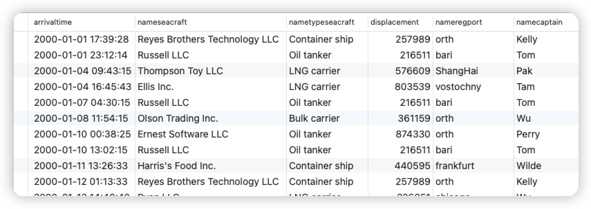

<div STYLE="page-break-after: always;"></div>

`Задание 2`. Корабль, зарегистрированные в Китае и прибывающие в Азербайджан более 2 раз

```sql
SELECT IDSeacraft, NameSeacraft, COUNT(IDSeacraft) AS Times
	FROM tb_arrivals
		INNER JOIN tb_seacrafts 
			ON tb_seacrafts.IDSeacraft=tb_arrivals.SeacraftID
	WHERE tb_arrivals.PortID 			IN (SELECT IDPort FROM tb_ports WHERE Country='Azerbaijan')
		AND tb_arrivals.SeacraftID 	IN (SELECT IDSeacraft AS SeacraftIDWithCountry FROM tb_seacrafts 
																			WHERE RegPortID IN (SELECT IDPort FROM tb_ports WHERE Country='China'))
	GROUP BY IDSeacraft, NameSeacraft
	HAVING COUNT(SeacraftID) > 2
	ORDER BY IDSeacraft
```


Вывод:

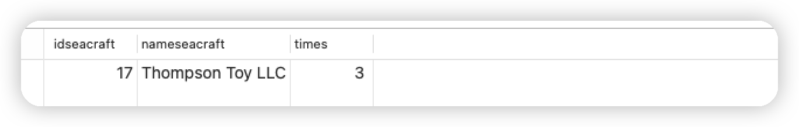

<div STYLE="page-break-after: always;"></div>

`Задание 3`. Капитаны со второй буквой своего имени `e` и количество раз, когда они прибывали к каждому пирсу. и выводить только записи с 10-й по 30-ю

```sql
WITH tb_NameCaptainWithE AS (
	SELECT * FROM tb_captains WHERE NameCaptain LIKE '_e%'
)
SELECT tb_NameCaptainWithE.NameCaptain, tb_ports.Country, tb_ports.NamePort, COUNT(tb_ports.IDPort)
	FROM tb_seacrafts
		INNER JOIN tb_arrivals
			ON tb_arrivals.SeacraftID=tb_seacrafts.IDSeacraft
		INNER JOIN tb_NameCaptainWithE
			ON tb_NameCaptainWithE.IDCaptain=tb_seacrafts.CaptainID
		INNER JOIN tb_ports
			ON tb_ports.IDPort=tb_arrivals.PortID
	GROUP BY tb_ports.Country, tb_ports.IDPort, tb_ports.NamePort, tb_NameCaptainWithE.NameCaptain
	ORDER BY tb_NameCaptainWithE.NameCaptain, tb_ports.Country, tb_ports.IDPort
	LIMIT 20 OFFSET 9
```


Вывод:

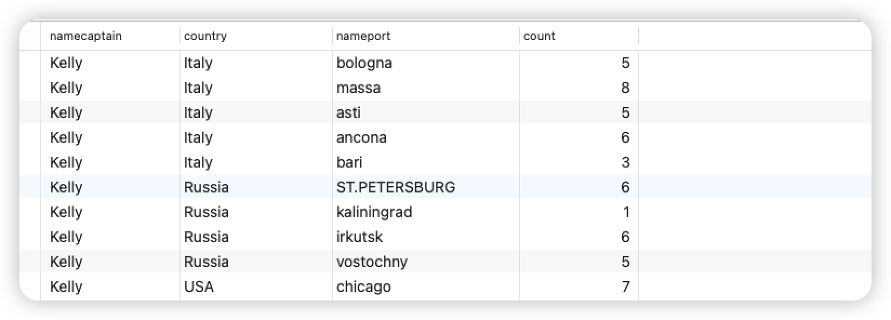


`Задание 4`. Сравнение тарифов каждого порта со средним значением тарифов по стране

```sql
SELECT IDPort, Country, NamePort, Price, AVG(Price) OVER (PARTITION BY Country)
	FROM tb_ports
	ORDER BY Country, NamePort
```


Вывод:

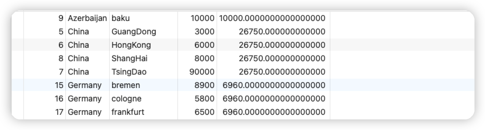


<div STYLE="page-break-after: always;"></div>


## Функции и язык PL/pgSQL

### Постановка задачи

Практическое задание посвящено упрощению работы с помощью создания и использования функций. При выполнении задания необходимо:

- Составить SQL-скрипты для создания `5` функций, упрощающих работу с данными.
- Продемонстрировать полученные знания о возможностях языка `PL/pgSQL`. В скриптах должны использоваться:
    - `Циклы`.
    - `Ветвления`.
    - `Переменные`.
    - `Курсоры`.
    - `Исключения`.
- Обосновать преимущества механизма функций перед механизмом представлений.


### Реализация

`Пример 1`. Оценка уровня времени, в течение которого корабль простаивает в порте

```sql
CREATE OR REPLACE FUNCTION fc_PortTimeChecker(INTEGER) RETURNS TEXT 
	LANGUAGE plpgsql
	AS $$
	DECLARE 
		t_ArrivalTime TIMESTAMP := (SELECT ArrivalTime::TIMESTAMP FROM tb_arrivals WHERE IDArrival=$1);
		t_LeaveTime TIMESTAMP := (SELECT LeaveTime::TIMESTAMP FROM tb_arrivals WHERE IDArrival=$1);
		Days INTEGER;
		msg TEXT;
	BEGIN
		IF (t_LeaveTime IS NULL) THEN 
			RAISE EXCEPTION '[ERROR] LeaveTime can not be NULL';
		END IF;
		
		Days := extract(day from t_LeaveTime - t_ArrivalTime);
		CASE
			WHEN Days BETWEEN 0 AND 30 THEN
				msg := 'Short';
			WHEN Days BETWEEN 30 AND 100 THEN
				msg := 'Normal';
			WHEN Days BETWEEN 100 AND 150 THEN
				msg := 'Long';
			ELSE
				msg := 'Very long';
		END CASE;
		
		RETURN msg;
	END;
	$$;
```


Вывод:

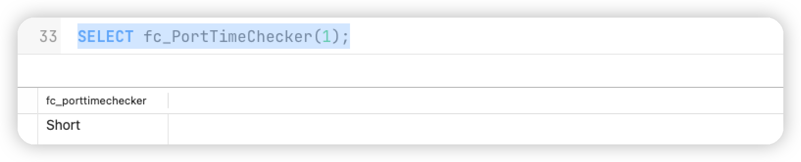

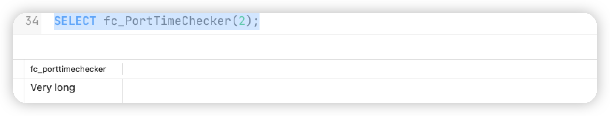

<div STYLE="page-break-after: always;"></div>

`Пример 2`. Оценка уровня времени, в течение которого корабль простаивает в порте (С цекром)

```sql
CREATE OR REPLACE FUNCTION fc_AllPortTimeChecker() RETURNS TEXT 
	LANGUAGE plpgsql
	AS $$
	DECLARE 
 		t_ArrivalTime TIMESTAMP;
 		t_LeaveTime TIMESTAMP;
		StartNum INTEGER := (SELECT min(idarrival) FROM tb_arrivals);
		StopNum INTEGER := (SELECT max(idarrival) FROM tb_arrivals);
		Days INTEGER;
		msg TEXT;
	BEGIN
		FOR counter IN StartNum .. StopNum LOOP
				IF (t_LeaveTime IS NULL) THEN 
					RAISE NOTICE 'IDArrival: % con not handle', counter;
				END IF;		
						
				t_ArrivalTime := (SELECT ArrivalTime::TIMESTAMP FROM tb_arrivals WHERE IDArrival=counter);
				t_LeaveTime := (SELECT LeaveTime::TIMESTAMP FROM tb_arrivals WHERE IDArrival=counter);
				Days := extract(day from t_LeaveTime - t_ArrivalTime);
				CASE
					WHEN Days BETWEEN 0 AND 30 THEN
						msg := 'Short';
					WHEN Days BETWEEN 30 AND 100 THEN
						msg := 'Normal';
					WHEN Days BETWEEN 100 AND 150 THEN
						msg := 'Long';
					ELSE
						msg := 'Very long';
				END CASE;
		
			RAISE NOTICE 'IDArrival: %, Level: %', counter, msg;
		END LOOP;
	
		RETURN msg;
	END;
	$$;
```


Вывод:

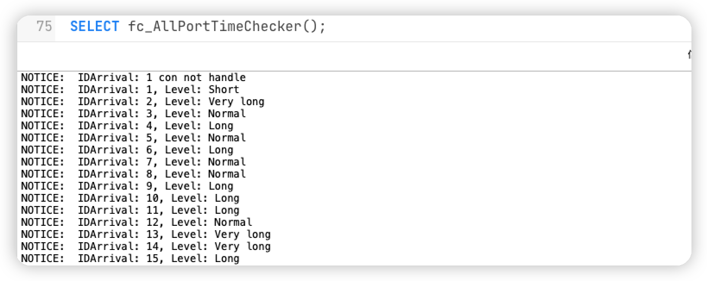

<div STYLE="page-break-after: always;"></div>

`Пример 3`. Получение пользовательского номера прибытия корабля

```sql
CREATE OR REPLACE FUNCTION get_arrival_num(INTEGER) RETURNS VARCHAR
	AS
		'SELECT to_char(ArrivalTime, ''yyyy'') 
						|| to_char(ArrivalTime, ''mm'') 
						|| to_char(ArrivalTime, ''dd'')
						|| lpad(IDArrival::TEXT, 5, ''0'')::TEXT 
						|| lpad(PortID::TEXT, 3, ''0'')::TEXT 
		FROM tb_arrivals WHERE IDArrival=$1'
	LANGUAGE SQL
	RETURNS NULL ON NULL INPUT;
```


Вывод:

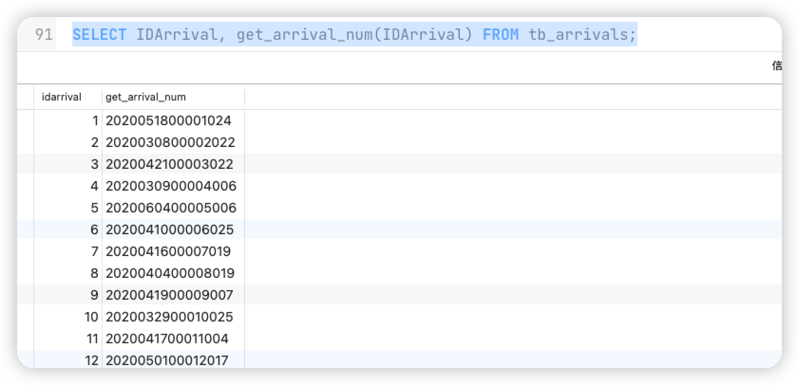

<div STYLE="page-break-after: always;"></div>

`Пример 4`. Получить общую продолжительность пребывания всех судов на основе назначенного порта

```sql
CREATE OR REPLACE FUNCTION fc_IncomePort(VARCHAR) RETURNS INTEGER
	AS
	'
			SELECT SUM(hours) AS hours FROM(
				SELECT EXTRACT(
					DAY FROM (
							SELECT SUM(LeaveTime::TIMESTAMP - ArrivalTime::TIMESTAMP)
							FROM tb_arrivals 
							WHERE PortID=(SELECT IDPort FROM tb_ports WHERE NamePort=$1)
						)
				) * 24 AS hours
				UNION ALL
				SELECT EXTRACT(
					HOUR FROM (
							SELECT SUM(LeaveTime::TIMESTAMP - ArrivalTime::TIMESTAMP)
							FROM tb_arrivals 
							WHERE PortID=(SELECT IDPort FROM tb_ports WHERE NamePort=$1)
						)
				) AS hours
		) AS hour_row
	'
	LANGUAGE SQL
	RETURNS NULL ON NULL INPUT;
```


Вывод:

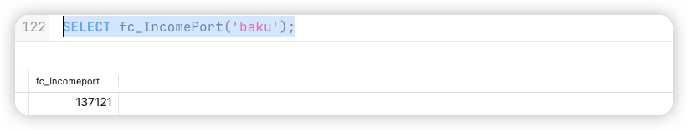

<div STYLE="page-break-after: always;"></div>


## Индивидуальное задание

• Объяснить, как работают написанные функции.

• Ренализовать `SELECT`-запросы `Задание_1`- `Задание_4` в виде функций.

• Модифицировать или упростить функции `Пример_1`-`Пример_4`.

• Составить SQL-скрипты для создания `5` функций, на языке `PL/pgSQL`. Каждый скрипт реализует следующие элементы:
    - **Цикл**.
    - **Ветвление**.
    - **Переменные**.
    - **Курсор**.
    - **Исключение**.
    
• Описать в каких случаях целесообразно создавать функции.

• Рассказать о курсорах, как и зачем используются.

• Рассказать о работе с циклами.

## Литература

1. [Функции](https://postgrespro.ru/docs/postgrespro/11/xfunc-sql)
2. [PL/PgSQL](https://postgrespro.ru/docs/postgrespro/11/plpgsql)
3. [Основные операторы](https://postgrespro.ru/docs/postgrespro/11/plpgsql-statements)
4. [Управляющие структуры](https://postgrespro.ru/docs/postgrespro/11/plpgsql-control-structures)
5. [Курсоры](https://postgrespro.ru/docs/postgrespro/11/plpgsql-cursors)
6. [Полное описание синтаксиса встретившихся команд](https://postgrespro.ru/docs/postgrespro/11/sql-commands)
